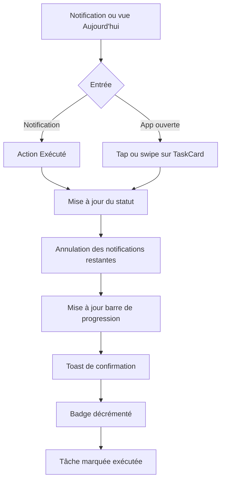
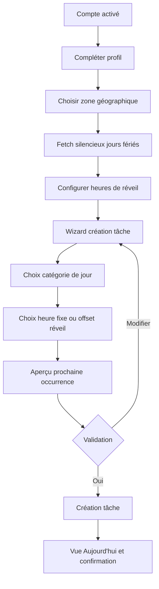
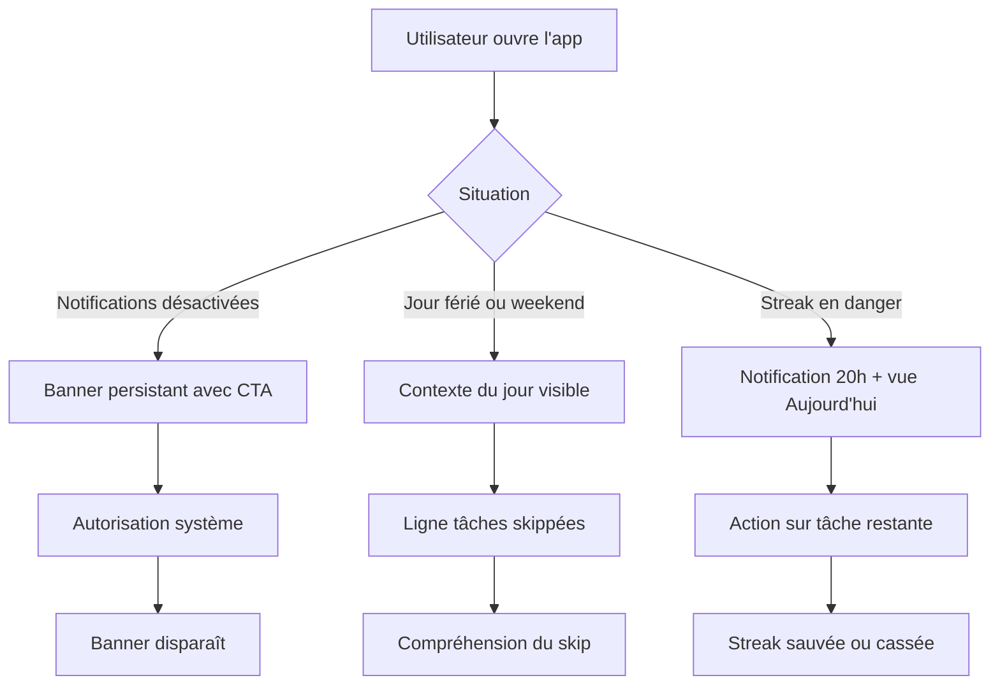

# UX Design Specification IA

**Author:** Gino Cachondeo
**Date:** 2026-03-24

---

## Executive Summary

### Project Vision

IA est une PWA mobile-first qui adapte le planning de la journée au profil du jour (travaillé, vacances, weekend + férié). Les tâches inadaptées sautent automatiquement, les jours fériés se synchronisent depuis l'API gouvernementale française, et les notifications s'annulent si la tâche est déjà exécutée. L'app transforme la gestion d'habitudes en expérience contextuelle et motivante pour un cercle restreint d'utilisateurs.

### Target Users

**Primaire - Gino (usage quotidien intensif)**  
Développeur, 35 ans. Utilise l'app comme outil de vie : plusieurs tâches récurrentes, suivi des streaks, consultation des stats. Expert technique, à l'aise avec la configuration avancée, mais veut une expérience fluide au quotidien sans friction.

**Secondaire - Proches (Marie et profils similaires)**  
Onboarding rapide guidé. Usage régulier mais moins expert. Besoin d'une app qui s'auto-configure au maximum et ne demande de décisions que sur l'essentiel.

### Key Design Challenges

1. **Complexité masquée** - Configuration riche (3 catégories, heures de réveil, récurrences étendues, suspension) doit être simple à l'usage quotidien.
2. **Modale agenda à 5 actions** - Hiérarchie claire entre action locale et action sur la série, avec confirmation explicite pour le destructif.
3. **Notifications alliées** - Jusqu'à 4 notifications par tâche et alertes contextuelles. L'UX doit rendre ce flux compréhensible et contrôlable.
4. **Accessibilité RGAA native** - Chaque composant critique doit être accessible dès le premier sprint.
5. **Agenda dual-mode** - Distinction visuelle immédiate entre passé consultable et futur modifiable.

### Design Opportunities

1. **Skip automatique rendu visible** - Afficher le contexte du jour et les tâches skippées transforme un mécanisme invisible en signe de confiance.
2. **Suspension comme décision saine** - La confirmation "ta streak est protégée" dédramatise et valorise l'intention.
3. **Agenda heatmap de vie** - Type de jour + statut d'exécution = journal visuel dense et utile.
4. **Vue Aujourd'hui comme cockpit émotionnel** - Barre de progression, badge streak et contexte du jour structurent l'expérience au premier coup d'oeil.

## Core User Experience

### Defining Experience

L'action centrale de IA est de marquer une tâche comme exécutée, directement depuis la notification push ou depuis la vue Aujourd'hui. C'est le micro-geste quotidien répété des dizaines de fois par semaine. Tout converge vers sa fluidité absolue : 0 friction, 1 geste, feedback immédiat.

### Platform Strategy

PWA installée sur écran d'accueil, comportement natif sans store. Mobile-first, desktop supporté mais non prioritaire. Pas de cache offline métier. Le Service Worker sert les notifications push. Capacités exploitées : Badge API, Notification Actions API, Web Push VAPID, `prefers-color-scheme`, `prefers-reduced-motion`.

### Effortless Interactions

- Marquer exécutée depuis la notification sans ouvrir l'app
- Skip automatique des tâches inadaptées à la catégorie du jour
- Calcul automatique de l'heure de tâche depuis le réveil configuré
- Fetch transparent des jours fériés à la création de compte
- Suspension d'occurrence en 1 tap avec confirmation streak protégée

### Critical Success Moments

| Moment | Résultat attendu |
|---|---|
| J+1 onboarding | Tâches à l'heure calculée depuis le réveil - "il a compris mon rythme" |
| Premier jour férié | Tâches travaillées absentes automatiquement - confiance système établie |
| Streak 7 jours | Badge + animation - accomplissement mesurable et valorisé |
| Changement de téléphone | Réinstallation rapide, données intactes, notifications réactivées |
| Tâche exécutée depuis notif | Confirmation immédiate - aucune ambiguïté sur l'action |

### Experience Principles

1. **L'app pense à ta place, tu fais juste** - Le contexte est géré automatiquement.
2. **Un geste, une réponse** - Chaque action produit un feedback immédiat et visible.
3. **Le passé est ancré, le futur est modifiable** - L'immuabilité du passé renforce la confiance.
4. **La difficulté est cachée, la récompense est visible** - Configuration guidée, gratification maîtrisée.
5. **Accessible par défaut** - Pas de couche d'accessibilité ajoutée plus tard.

## Desired Emotional Response

### Primary Emotional Goals

Emotion principale : **confiance sereine**.  
Emotions secondaires : sentiment d'avancement quotidien, légèreté mentale, fierté sobre sur les jalons de streak.

### Emotional Journey Mapping

| Moment | Emotion visée | Emotion à éviter |
|---|---|---|
| Onboarding | Confiance rapide | Surcharge paramétrique |
| Premier jour | Surprise positive | Déception |
| Action quotidienne | Satisfaction immédiate | Doute |
| Jour férié auto-géré | Soulagement | Inquiétude streak |
| Suspension justifiée | Sécurité | Culpabilité |
| Streak cassée | Motivation à reprendre | Abandon |
| Badge débloqué | Fierté concrète | Indifférence |
| Consultation stats | Auto-analyse positive | Jugement négatif |

### Micro-Emotions

- **Confiance vs scepticisme** : une disparition de tâche est toujours expliquée
- **Accomplissement vs frustration** : confirmation non négociable après action
- **Légèreté vs anxiété** : banners et messages orientés solution
- **Fierté vs indifférence** : animation streak rare et mémorable

### Design Implications

| Emotion | Décision UX |
|---|---|
| Confiance | Catégorie du jour visible + "X tâches skippées" |
| Satisfaction | Toast après toute action significative |
| Légèreté | Actions ordonnées du moins au plus destructif |
| Fierté sobre | Animation streak réservée aux jalons |
| Motivation | Aucune punition visuelle excessive |
| Auto-analyse positive | Stats factuelles, comparatives, non moralisantes |

### Emotional Design Principles

1. **Transparence active** - Les comportements automatiques sont visibles.
2. **Feedback sans latence** - Toute action reçoit une réponse claire.
3. **Échec sans punition** - L'app encourage la reprise.
4. **Récompense méritée** - Badges rares et significatifs.
5. **Charge cognitive minimale** - L'état du système est toujours visible.

## UX Pattern Analysis & Inspiration

### Inspiring Products Analysis

**Streaks (iOS)** - Motivation par streak, interface épurée, grille lisible.  
**Duolingo** - Gamification émotionnelle forte, onboarding progressif.  
**Things 3 / Notion** - Hiérarchie claire, édition non destructive.  
**Apple / Google Calendar** - Vue mois lisible, couleur sémantique, repères forts.

### Transferable UX Patterns

- Navigation par bottom tab bar 4 onglets
- Swipe-to-complete sur la vue Aujourd'hui
- Long press contextuel sur une tâche
- Bottom sheet pour actions locales
- Formulaire pas-à-pas avec aperçu avant validation
- Heatmap agenda par statut + catégorie de jour

### Anti-Patterns to Avoid

| Anti-pattern | Raison |
|---|---|
| Modale plein écran pour 5 actions | Trop lourde sur mobile |
| Notification sans action directe | Brise la promesse de rapidité |
| Streak-sanction agressive | Contredit la gamification honnête |
| Configuration massive à l'onboarding | Surcharge cognitive inutile |
| Stats sans comparaison | Peu utiles et peu lisibles |
| Edition de récurrence sans clarification | Risque de casse sur la série |

### Design Inspiration Strategy

**Adopter** : bottom tab bar, bottom sheets, flamme streak, heatmap agenda, progress bar.  
**Adapter** : gamification de Duolingo en version plus sobre.  
**Éviter** : surcharge visuelle, fausse urgence, modales écrasantes.

## Design System Foundation

### Design System Choice

**shadcn/ui + Tailwind CSS**

### Rationale for Selection

- Composants accessibles basés sur Radix UI
- Thème clair/sombre via CSS variables
- Sheet, Dialog, Toast, Progress disponibles immédiatement
- Forte personnalisation sans dépendance opaque
- Adapté à un développement solo rapide et maîtrisé

### Implementation Approach

Design tokens CSS variables pour couleurs sémantiques, statuts d'exécution, type de jour et streak. Les composants shadcn/ui sont copiés et ajustés localement.

### Customization Strategy

- **Tokens sémantiques** : jours travaillés, vacances, weekend + férié, exécution, suspension, streak
- **Composants shadcn utilisés** : Sheet, Dialog, Toast, Progress, Badge, Calendar, DropdownMenu, Avatar, Switch
- **Composants custom** : TaskCard, StreakFlame, DayIndicator, NotificationBanner, StepForm

## 2. Core User Experience

### 2.1 Defining Experience

"Confirme ta journée en un geste - l'app a déjà tout préparé."  
L'interaction centrale est le micro-geste quotidien de confirmation : marquer une tâche exécutée depuis la notification push ou depuis la vue Aujourd'hui.

### 2.2 User Mental Model

L'utilisateur attend que IA sache quel type de jour c'est, calcule les heures automatiquement, confirme chaque action immédiatement et explique toute disparition de tâche. Les zones de confusion potentielles sont : tâche absente sans explication, doute post-action, lien entre suspension et streak.

### 2.3 Success Criteria

- Marquer exécutée depuis notification : <= 1 geste, <= 2s
- Marquer exécutée depuis vue Aujourd'hui : <= 1 tap ou swipe
- Feedback visuel : < 500ms
- Raison de l'absence d'une tâche : visible sans navigation
- Confirmation "streak protégée" dans le flux de suspension

### 2.4 Novel UX Patterns

**Skip automatique** : contexte du jour affiché en permanence + ligne "X tâches skippées".  
**Suspension protège la streak** : confirmation explicite dans la bottom sheet.  
**Heure calculée depuis réveil** : aperçu de prochaine occurrence avant validation.

### 2.5 Experience Mechanics

**Flux notification push** : notification avec boutons -> action -> mise à jour du statut -> annulation des rappels restants -> toast -> badge décrémenté.  
**Flux vue Aujourd'hui** : tap ou swipe -> animation de complétion -> toast -> progression mise à jour.  
**Flux suspension** : long press -> "Suspendre aujourd'hui" -> confirmation "Ta streak est protégée" -> tâche grisée -> compteur ajusté.

## Visual Design Foundation

### Color System

Le système visuel doit communiquer le contexte du jour avant même la lecture. La palette sémantique repose sur :

- **Jour travaillé** : bleu soutenu, fiable, orienté action
- **Vacances** : vert doux, respiration, souplesse
- **Weekend + férié** : gris ardoise calme
- **Exécuté** : vert validation immédiate
- **Non exécuté** : rouge sobre, jamais criard
- **Suspendu / skippé** : ambre ou gris atténué
- **Streak** : orange flamme réservé aux moments de récompense

Les surfaces principales restent lumineuses, avec un contraste fort texte/fond. Le mode sombre conserve la même logique sémantique.

### Typography System

La typographie doit privilégier vitesse de lecture et différenciation nette des niveaux d'information.

- Titres et chiffres clés : sans-serif moderne, poids 600-700
- Corps : sans-serif neutre, poids 400-500
- Micro-copie système : ton direct, rassurant, phrases courtes
- Indicateurs numériques : rendu visuel plus ferme pour KPI, streaks et badges

Hiérarchie recommandée :

- H1 28/32
- H2 22/28
- H3 18/24
- Body 16/24
- Secondary 14/20
- Caption 12/16

### Spacing & Layout Foundation

Base d'espacement `8px`, adaptée à une app mobile dense mais respirante.

Principes :

- Mobile-first strict sur largeur 360-430px
- Une colonne principale sur mobile
- Cartes de tâches à forte lisibilité verticale
- Bottom tab bar fixe comme ancrage
- Bottom sheets pour décisions locales
- Sur desktop : recentrage du contenu et panneau secondaire possible sans changer le modèle mental

Règles d'espacement :

- 8px pour micro-espaces
- 12-16px intra-composant
- 24px entre sections
- 32px pour respirations d'écran et blocs KPI

### Accessibility Considerations

- Contraste WCAG AA minimum
- Cibles tactiles `44x44px`
- Icônes jamais seules pour signifier un état critique
- Focus visible systématique
- Toasts couplés à des live regions
- Respect de `prefers-reduced-motion`
- Formulaires avec labels explicites, ordre logique et messages d'erreur reliés
- Les libellés visibles suivent un français naturel avec accents corrects ; aucun code métier brut du type `WORKDAY` n'est affiché à l'utilisateur

## Design Direction Decision

### Design Directions Explored

Trois directions ressortent du travail déjà mené :

1. **Dashboard gamifié fort** : accent sur streaks, badges et récompenses
2. **Agenda utilitaire minimal** : lecture immédiate et pilotage opérationnel
3. **Cockpit contextuel sobre** : équilibre entre contexte, efficacité et gratification mesurée

### Chosen Direction

La direction retenue est le **cockpit contextuel sobre**.

Caractéristiques :

- La vue Aujourd'hui s'ouvre sur le contexte du jour
- Les récompenses restent secondaires face au pilotage quotidien
- Les statuts, le type de jour et la progression dominent la hiérarchie visuelle
- Les couleurs informent avant de décorer
- Les interactions principales sont directes : tap, swipe, long press, bottom sheet

### Design Rationale

- Respecte la promesse "l'app pense à ta place"
- Réduit la surcharge sur un usage quotidien intensif
- Valorise la confiance système plutôt que l'excitation artificielle
- Permet une gamification sobre et durable
- Reste extensible vers stats, objectifs et agenda

### Implementation Approach

- Faire de la vue Aujourd'hui l'écran héros du produit
- Réserver la saturation colorée aux statuts et contextes
- Utiliser un header de contexte, des cartes compactes et une progression persistante
- Distinguer clairement couches permanentes et couches transitoires

## User Journey Flows

### Exécuter une tâche du jour

Objectif : confirmer une tâche avec la friction la plus faible possible depuis notification ou vue Aujourd'hui.

Optimisations :

- Entrées multiples, résultat identique
- Feedback sous 500 ms
- Aucune ambiguïté persistante sur la prise en compte

### Onboarding et première tâche

Objectif : amener une nouvelle utilisatrice de compte vide à une première occurrence correctement planifiée.

Optimisations :

- Décisions regroupées par étapes courtes
- Aperçu avant validation pour construire la confiance
- Synchronisation des jours fériés invisible mais explicable

### Gérer une friction de contexte

Objectif : expliquer pourquoi une tâche n'apparaît pas ou pourquoi la journée est à risque.

Optimisations :

- Chaque friction a une explication visible
- Chaque friction a une sortie claire
- Les comportements automatiques ne sont jamais opaques quand ils modifient le quotidien perçu

### Journey Patterns

- Les parcours commencent toujours par un contexte visible
- Les actions critiques ont un retour immédiat et unique
- Les choix destructifs sont confirmés dans une bottom sheet
- Les exceptions système sont expliquées près de leur impact

### Flow Optimization Principles

- Aller à la valeur en un geste quand l'intention est claire
- Déporter la complexité dans la configuration, pas dans l'action quotidienne
- Montrer l'effet d'une action sur la journée complète
- Prévoir une sortie de secours explicite en cas de doute

## Component Strategy

### Design System Components

Composants shadcn/ui mobilisables directement :

- `Sheet`
- `Dialog`
- `Toast`
- `Progress`
- `Calendar`
- `Badge`
- `Tabs`
- `Switch`
- `DropdownMenu`
- `Avatar`
- `Tooltip`
- `Popover`

Ces briques couvrent la structure, mais pas la logique contextuelle propre à IA.

### Custom Components

#### TaskCard

**Purpose:** composant central de la vue Aujourd'hui et des listes agenda.  
**Usage:** afficher une occurrence avec statut, heure, contexte et actions rapides.  
**Anatomy:** icône ou photo, titre, heure planifiée, badge contexte, zone swipe, menu secondaire.  
**States:** par défaut, exécutée, non exécutée, suspendue, skippée, future, passée figée.  
**Accessibility:** annonce vocale du statut, action principale au clavier, cible tactile large.

#### DayContextHeader

**Purpose:** rendre visible le type de jour et ses impacts.  
**Usage:** en haut de la vue Aujourd'hui et de l'agenda.  
**Content:** date, catégorie du jour, résumé "X tâches actives / Y skippées".  
**States:** nominal, jour férié, vacances, risque streak.

#### StreakFlame

**Purpose:** afficher la streak sans transformer l'interface en jeu.  
**Usage:** header, stats, jalons.  
**States:** inactive, active, danger, badge milestone.  
**Accessibility:** texte associé obligatoire, animation facultative.

#### StepForm

**Purpose:** encapsuler les formulaires guidés complexes.  
**Usage:** onboarding, création et édition de tâche.  
**Content:** étape courante, progression, champs, aperçu, CTA primaire et secondaire.  
**Accessibility:** structure explicite, erreurs liées aux champs, navigation clavier.

#### DayIndicator

**Purpose:** encoder dans l'agenda la combinaison type de jour + statut global.  
**Usage:** cellules calendrier mois et mini-calendriers stats.  
**Variants:** passé, futur, mixte, complet, vide, jour férié.

#### NotificationBanner

**Purpose:** traiter les risques système visibles sans interrompre.  
**Usage:** notifications désactivées, permission manquante, erreur sync.  
**Behavior:** persistant tant que le problème subsiste, CTA unique et clair.

### Component Implementation Strategy

- Construire les composants custom à partir des tokens design
- Standardiser les props de statut (`planned`, `done`, `missed`, `suspended`, `skipped`)
- Isoler les calculs métier dans des helpers dédiés
- Définir explicitement états vides, chargement, erreur et succès

### Implementation Roadmap

**Phase 1 - Critique produit**

- `TaskCard`
- `DayContextHeader`
- `NotificationBanner`
- `StreakFlame`

**Phase 2 - Flux de création et agenda**

- `StepForm`
- `DayIndicator`
- Variantes agenda semaine et mois

**Phase 3 - Raffinement et stats**

- Cartes KPI comparatives
- Composants objectifs hebdo/mensuels
- Etats de reporting et export

## UX Consistency Patterns

### Button Hierarchy

- **Primaire** : une seule action dominante par vue ou sheet
- **Secondaire** : action utile mais non critique
- **Tertiaire** : annuler, fermer, revenir
- **Destructive** : réservé aux suppressions et modifications de série

Règle : dans une bottom sheet d'occurrence, l'action sur l'occurrence seule précède toujours l'action sur "cette occurrence + suivantes".
La bottom sheet d'édition de série permet aussi de modifier le type de récurrence, les jours de semaine, les jours concernés et la date de fin, avec préremplissage fidèle du mode horaire existant.
L'écran "Gérer les occurrences" affiche par défaut les seules occurrences futures, avec pagination backend, recherche par nom et filtres visibles sur les dates d'occurrence, le type de tâche et le mode horaire. Les filtres de dates servent aussi à rouvrir explicitement le passé en lecture.

### Feedback Patterns

- Succès : toast court, ton factuel, disparition automatique
- Avertissement : banner ou notice inline si une action future est menacée
- Erreur : message explicite + action corrective immédiate
- Information : micro-copie contextuelle au plus près de la zone concernée

Chaque feedback critique doit répondre à trois questions : qu'est-ce qui s'est passé, quel impact, que faire ensuite.

### Form Patterns

- Wizard pour formulaires longs ou conceptuellement riches
- Validation au fil de l'eau sur mobile
- Aperçu des conséquences avant confirmation pour toute planification temporelle
- Texte d'aide orienté intention utilisateur, pas modèle interne
- Exemple concret de prochaine occurrence pour toute récurrence

### Navigation Patterns

- Bottom navigation 4 onglets sur mobile
- Retour gestuel et CTA retour cohérents dans sheets et formulaires
- Le passé est consultable mais non éditable, et cela doit être visible
- Les zones profondes peuvent utiliser une navigation secondaire sans nuire aux 4 onglets principaux

### Additional Patterns

**Loading states**

- Skeletons pour cartes et KPI
- Jamais de spinner seul sur une action critique

**Empty states**

- Toujours orientés vers la prochaine action utile
- Exemple : "Aucune tâche aujourd'hui" + explication de contexte ou CTA de création

**Modal & sheet patterns**

- Bottom sheet pour choix local
- Dialog centré seulement pour confirmation lourde ou destruction majeure

**Status semantics**

- Exécuté = résolution positive
- Non exécuté = fait constaté
- Suspendu = choix intentionnel
- Skippé = effet du contexte

## Responsive Design & Accessibility

### Responsive Strategy

La stratégie est **mobile-first stricte**, puis expansion contrôlée vers tablette et desktop.

- **Mobile** : référence produit, usage pouce, navigation basse, cartes verticales
- **Tablet** : plus de densité en agenda et stats, mêmes patterns tactiles
- **Desktop** : mise en page en panneaux, sans changer l'ordre mental appris sur mobile

Sur grand écran, la vue Aujourd'hui peut afficher une colonne principale et un panneau latéral contextuel.

### Breakpoint Strategy

- `320-479px` : petits mobiles
- `480-767px` : mobiles confort
- `768-1023px` : tablettes
- `1024-1439px` : desktop standard
- `1440px+` : desktop large

Approche technique :

- Media queries mobile-first
- Typographie fluide limitée
- Grilles simples, sans re-layout brutal

### Accessibility Strategy

Niveau cible : **WCAG 2.2 AA** minimum, cohérent avec l'ambition RGAA native.

Exigences :

- Navigation clavier complète
- Ordre de focus logique
- Noms accessibles explicites sur toutes les actions
- Live regions pour toasts, compteurs et changements de statut
- Support lecteurs d'écran pour calendrier, sheets et formulaires multi-étapes
- Aucune information critique portée uniquement par la couleur
- Réduction de mouvement respectée globalement

### Testing Strategy

- Revue responsive sur iPhone SE, iPhone standard, Android moyen format, iPad, laptop
- Tests clavier sur tous les flux critiques
- Validation VoiceOver et NVDA sur navigation principale, formulaires et agenda
- Audit automatisé `axe` et `lighthouse`
- Simulation de permissions refusées, mode sombre, zoom 200%, contraste renforcé
- Tests gestuels pour swipe, long press et bottom sheets

### Implementation Guidelines

- Utiliser HTML sémantique avant ARIA
- Gérer explicitement le focus à l'ouverture et fermeture des sheets et dialogs
- Ne jamais piéger le focus hors contexte modal
- Garder les composants interactifs idempotents quand possible
- Documenter les micro-copies comme partie du design
- Définir des tokens de contraste et d'état utilisables en clair et sombre
- Tester chaque composant custom sur un scénario nominal et un scénario d'échec

## Workflow Completion

Le workflow UX BMAD est maintenant aligné avec le PRD et complété jusqu'à la fin du parcours.

Livrables attendus dans `planning-artifacts` :

- `ux-design-specification.md`
- `ux-color-themes.html`
- `ux-design-directions.html`

### Recommended Next Steps

1. Générer les wireframes principaux à partir de cette spec
2. Créer l'architecture technique en s'appuyant sur les composants et les flux
3. Découper le produit en epics et stories d'implémentation
